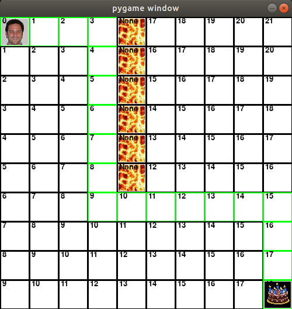
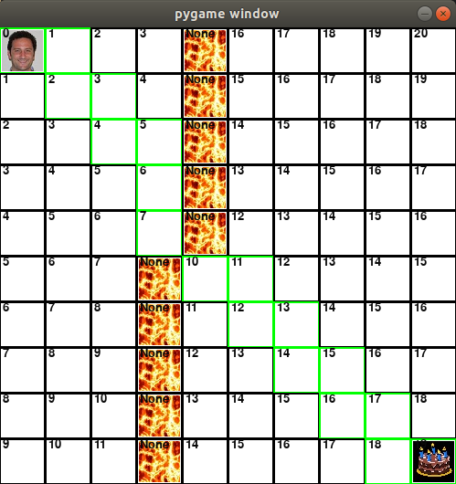
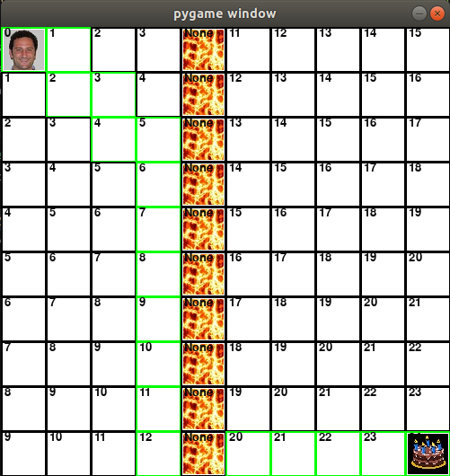

# More details

## Cost to draw  
| cost_f             |  cost_g             |  cost_h             |
|:------------------:|:-------------------:|:-------------------:|
|    |    |    |

- f: This variable represents the score for that square, which is equivalent to g + h. Its' minimum on the board is equal to the cost of the shortest path.
- g: This variable represents the movement cost from the starting point to that square. I would describe it as the minimum number of steps (+ terrain cost if applicable) that it would take to get to a given square.
- h: This variable represents the estimated movement cost from that square to to the end point, basically the reverse of g.

## Features  
| diagonal           |  jump               |  swamp              |
|:------------------:|:-------------------:|:-------------------:|
|    |    |    |

- diagonal: This path is an example where the actor is forced to move diagonally, adding 3 movement points and proving that the feature works.
- jump: This path is an example where the actor is forced to jump over lava, adding 8 movement points and proving that the feature works.
- swamp: This path is an example where the actor is forced to walk through a swamp, adding 3 movement points and proving that the feature works.

## Challenge  
  

**What's the worst path you can come up with?**  
Mine had a cost of 247 movement points.
